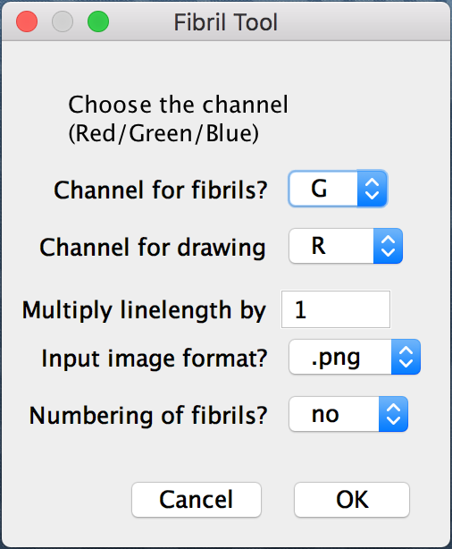

```{r setup, include = FALSE}
knitr::opts_chunk$set(
  collapse = TRUE,
  comment = "#>"
)
```

This code is an automated version of the Fiji [1] plugin FibrilTool [2, 3]. It was used for the first in [4]. In this version, the user draw and save all ROIs first and then let the macro compute automatically microtubule orientation and quality of microtubules orientation on the set of ROI.

```{r, echo=FALSE, fig.align='center'}
knitr::include_graphics("./images/FibrilTool_Batch.png")
```
**The FibrilTool batch version of the Fibril Tool Fiji plugin allows to compute orientation and quality of orientation of microtubules for several ROIs (and several images) in one go.** (A) Raw image (see below Example data for more informations). (B) Raw image and Regions Of Interest (ROIs). (C) Raw image and orientation (red line) and quality of orientation (length of the line) of the microtubules for each ROI.

## How to cite


## Installation

Download the .ijm file and the /Working_dir.

## Example data

/Working_dir contains a .png image and associated ROI set to test the FibrilTool Batch script. The test image is the 2D projection of a confocal stack of a shoot apical meristem of *Arabidopsis thaliana* imaged from top. The plant express a fluorescent marker attached to a protein binding the microtubules (MBD) under an ubiquitous promoter (p35S). Each ROI correspond to the contour of one cell.   

## Requirements

.png 2D projection of one or several confocal stacks of fibrils (microtubules, actin…), and associated cell contours saved as a unique RoiSet.zip file  on ImageJ/Fiji. Projection file and RoiSet.zip file must share the same name, for instance «my_image.png» and  «my_image_RoiSet.zip» and be stored in the same working directory. See attached example of working directory (/Working_dir).
You can include in your directory some images without any ROI (they will be skipped) and you can have single ROI («my_image.roi»).
You can choose between .png, .tif and .tiff images. In Full_Log you now get the real name of the ROI instead of an incrementing number, after the name of the image.

## Running the macro

Drag and drop the .ijm file in Fiji [1]. Click on "Run". 

1\) Choose working directory (see Requirements).   

2\) Select Channels      
As in the manual version, select channels color of fibrils and channel color to draw mean orientation. Select also the input format of the images (.png, .tif or .tiff).    

```{r, echo=FALSE, out.width="22%", fig.align='center'}

```


3\) Macro is processing      
Do not click on your screen, let the macro work. As there is not batch mode for the moment, clicking may interfere with the definition of the active window. This step is very slow, do not hesitate to run it overnight. If process abort for unknown reason, do not hesitate to run macro again (without modifying anything). This solves the problem in most of the cases.

During this step, the macro takes each ROI of a given set one by one and computes fibril orientation. If there is several RoiSet files, the macro loops over all given RoiSets.

4\) Macro output      
For each projection, the macro saves several files. A Log.txt file containing all informations on microtubule orientation (angle and quality) for ROI  (e.g. each cell contour) of this projection (see [3] for details of Log.txt file content). Two .tif files on which are projected the orientation of microtubules over stack projection background or over black background. And two new RoiSet.zip files, containing ROI of orientation of fibrils (MTs stands for microtubules) with or without original ROI (e.g. cell contour).


## References

1. Schindelin J, Arganda-Carreras I, Frise E, Kaynig V, Longair M, Pietzsch T, Preibisch S, Rueden C, Saalfeld S, Schmid B, Tinevez J-Y, White D J, Hartenstein V, Eliceiri K, Tomancak P, and Cardona A: **Fiji: an open-source platform for biological-image analysis.** *Nat Methods* 2012, **9**:676–682.
2. Uyttewaal M, Burian A, Alim K, Landrein B, Borowska-Wykret D, Dedieu A, Peaucelle A, Ludynia M, Traas J, Boudaoud A, Kwiatkowska D, and Hamant O: **Mechanical Stress Acts via Katanin to Amplify Differences in Growth Rate between Adjacent Cells in Arabidopsis.** *Cell* 2012, **149**:439–451.
3. Boudaoud A, Burian A, Borowska-Wykręt D, Uyttewaal M, Wrzalik R, Kwiatkowska D, and Hamant O: **FibrilTool, an ImageJ plug-in to quantify fibrillar structures in raw microscopy images.** *Nat. Protoc.* 2014, **9**:457–463.
4. Louveaux M, Rochette S, Beauzamy L, Boudaoud A, and Hamant O: **The impact of mechanical compression on cortical microtubules in Arabidopsis: a quantitative pipeline.** *Plant J* 2016, **88**:328–342.


